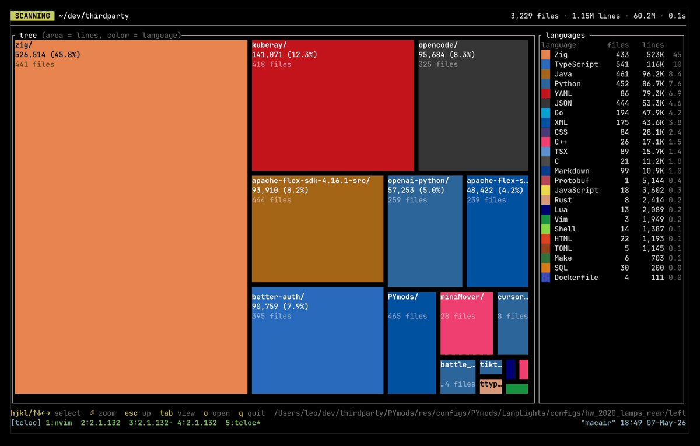
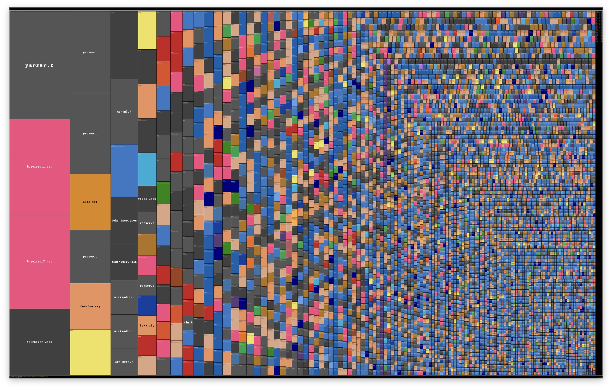
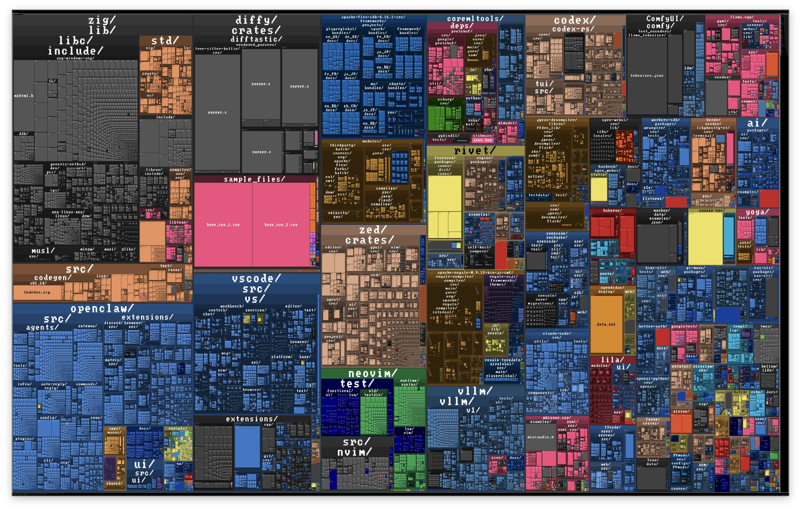

# tcloc

A performant TUI that renders a live treemap of your codebase, sized by lines
of code and colored by language. Inspired by
[cloc](https://github.com/AlDanial/cloc).







## Install

```bash
cargo install --git https://github.com/leonardcser/tcloc
# or from a local clone
cargo install --path .
```

## Usage

```bash
tcloc [PATH]
```

Scan the current directory:

```bash
tcloc
```

Scan only files tracked by git:

```bash
tcloc --vcs git
```

## Views

`Tab` cycles between three views:

- **tree** — folders and files at the current depth.
- **files** — every file flattened, regardless of depth.
- **nested** — full hierarchy at once. Each folder is a darker container of its
  dominant language; its children sit inside it, recursively.

## Navigation

| Input                     | Action                              |
| ------------------------- | ----------------------------------- |
| `hjkl` / arrow keys       | Move selection                      |
| `Enter`                   | Zoom into the selected folder       |
| `Esc` / `Backspace`       | Go up one level                     |
| `Tab`                     | Cycle view                          |
| `o`                       | Open the selected file in `$EDITOR` |
| Left-click a folder       | Zoom in                             |
| Right-click               | Go up                               |
| Mouse wheel on legend     | Scroll the language list            |
| `q` / `Ctrl-C` / `Ctrl-D` | Quit                                |

## Options

| Flag                       | Description                                                      |
| -------------------------- | ---------------------------------------------------------------- |
| `--vcs <VCS>`              | Use a VCS to enumerate files (only `git` supported)              |
| `-j, --threads <N>`        | Worker threads (default: logical CPUs)                           |
| `--max-file-size <MB>`     | Skip files larger than N MB (default: 100)                       |
| `--exclude-dir <NAMES>`    | Comma-separated directory names to skip                          |
| `--include-dir <NAMES>`    | Comma-separated top-level directory names to include             |
| `--exclude-ext <EXTS>`     | Comma-separated file extensions to exclude                       |
| `--include-ext <EXTS>`     | Comma-separated file extensions to include                       |
| `--exclude-lang <LANGS>`   | Comma-separated languages to exclude                             |
| `--include-lang <LANGS>`   | Comma-separated languages to include                             |
| `-H, --hidden`             | Include hidden files and directories                             |
| `-I, --no-ignore`          | Do not honor `.gitignore` / `.ignore`                            |
| `-L, --follow-links`       | Follow symbolic links                                            |
| `-w, --watch`              | Watch the scan root and apply incremental updates on file change |
| `-b, --bench`              | Show a live performance HUD and print a benchmark report on exit |
| `--auto-exit-ms <MS>`      | Exit N ms after the scan finishes (useful with `--bench`)        |

Run `tcloc --help` for the full list.
